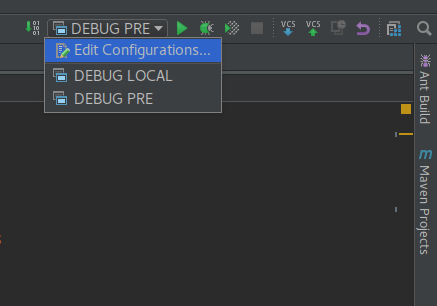
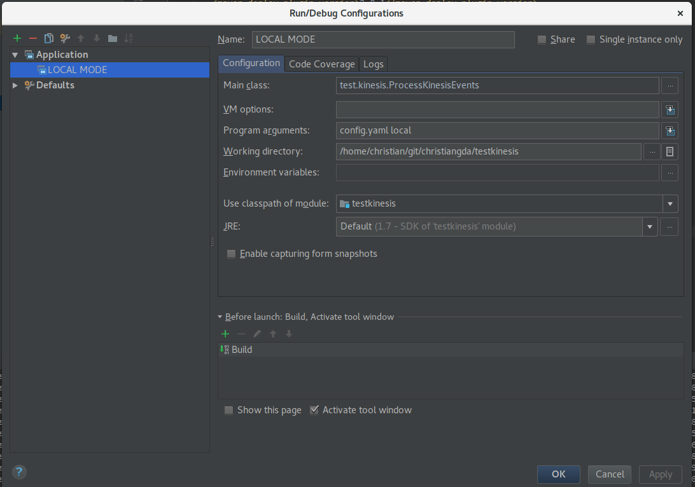

# Test AWS Kinesis Spout with Apache Storm 1.0.2
Until [AWS kinesis-storm-spout](https://github.com/awslabs/kinesis-storm-spout)
maintaners don't have created a new release with support for [Apache Storm 1.0.2](http://storm.apache.org/), you will need merge a [kinesis-storm-spout github project --> PR #43](https://github.com/awslabs/kinesis-storm-spout/pull/43)
to master branch to create your own artifact.

The goal of this project is show you how to use [AWS kinesis-storm-spout](https://github.com/awslabs/kinesis-storm-spout) with [Apache Storm 1.0.2](http://storm.apache.org/) before we don't have a official release!

## Requirements

* [Java JDK 7](http://www.oracle.com/technetwork/es/java/javase/downloads/jdk7-downloads-1880260.html)
* [Maven >= 3.3.9](https://maven.apache.org/)
* [IntelliJ >= 2016.x](https://www.jetbrains.com/idea/)
* [AWS Account](https://aws.amazon.com/)
* [AWS Command Line Interface (CLI)](http://docs.aws.amazon.com/cli/latest/userguide/installing.html)

## Before start

### Configure your AWS profile

Create a [AWS IAM User](http://docs.aws.amazon.com/AWSSimpleQueueService/latest/SQSGettingStartedGuide/AWSCredentials.html)
and configure your [AWS CLI profile](http://docs.aws.amazon.com/cli/latest/userguide/cli-chap-getting-started.html#cli-quick-configuration)
 to looks like this
```renderscript
cat ~/.aws/credentials
[test-kinesis]
aws_access_key_id = <your access key here>
aws_secret_access_key = <your secret key here>

```

### Create kinesis stream in your AWS account

Using awscli you can create a kinesis stream
```renderscript
aws kinesis create-stream \
  --stream-name my-kinesis-stream \
  --shard-count 1 \
  --profile test-kinesis \
  --region us-west-2
```

If you want to check your kinesis stream, you can execute 
```renderscript
aws kinesis describe-stream \
  --stream-name my-kinesis-stream \
  --profile test-kinesis \
  --region us-west-2
```

Output
```json
{
    "StreamDescription": {
        "RetentionPeriodHours": 24, 
        "StreamStatus": "ACTIVE", 
        "StreamName": "my-kinesis-stream", 
        "StreamARN": "arn:aws:kinesis:us-west-2:<your account number>:stream/my-kinesis-stream", 
        "Shards": [
            {
                "ShardId": "shardId-000000000000", 
                "HashKeyRange": {
                    "EndingHashKey": "340282366920938463463374607431768211455", 
                    "StartingHashKey": "0"
                }, 
                "SequenceNumberRange": {
                    "StartingSequenceNumber": "49567915227800817002758097934824822541916750785745518594"
                }
            }
        ]
    }
}

```
until now , we finish with kinesis.

## How to create a new kinesis-storm-spout artifact 

### Get the Pull Request #43

```renderscript
cd /tmp
git clone https://github.com/awslabs/kinesis-storm-spout.git
cd kinesis-storm-spout/
git fetch origin pull/43/head:upgrade-storm
git checkout upgrade-storm
```

### Override project version with your own version

```renderscript
mvn versions:set -DnewVersion=1.2.0-custom-1
```

### Compile and Package

```renderscript
mvn clean package
```

### Override project DeplymentRepository to deploy local
I'm assuming that you have installed Maven, and remember to change `<put your username here!>`

```renderscript
cd /tmp/kinesis-storm-spout/

mvn -Dgpg.skip -DaltDeploymentRepository=internal.repo::default::file:///home/<put your username here!>/.m2 deploy
```
Just now we have a artifact supporting [Apache Storm 1.0.2](http://storm.apache.org/)

## Clone and run this project

now we need to clone this project,

### Cloning the project

```renderscript
mkdir ~/gitprojects
cd ~/gitprojects
git clone https://github.com/christiangda/test-kinesis-storm-spout.git
```

### Putting data into our AWS Kinesis stream

Before running our topology, is necessary [put some data into our kinesis stream](http://docs.aws.amazon.com/streams/latest/dev/fundamental-stream.html#put-record)

```renderscript
aws kinesis put-record \
  --stream-name my-kinesis-stream \
  --partition-key 1 \
  --data '{"author":"Christian González", "topology":"ProcessKinesisEvents", "spout":"kinesis-storm-spout"}' \
  --profile test-kinesis \
  --region us-west-2
```

### Open this project using IntelliJ IDE

After import this project using [IntelliJ IDE](https://www.jetbrains.com/idea/), you can compile and execute it

#### Using IntelliJ to run Apache Storm Topoly




